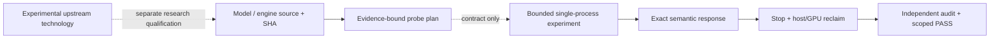

# gnostral.rs

**Rust-first inference research, tested on hardware that does not have spare VRAM.**

*Quantized models. Model/engine lifecycle. Residency. Verified performance. No imaginary PASS.*

[Get started](docs/START_HERE.md) · [Capability matrix](docs/CAPABILITY_MATRIX.md) · [Live QUESTLOG](QUESTLOG.md) · [Technical roadmap](docs/ROADMAP.md) · [Architecture](docs/ARCHITECTURE.md) · [Reproducibility](docs/REPRODUCIBILITY.md)

> **FR —** gnostral.rs est un laboratoire ouvert d'inférence locale en Rust sur GPU contraint. Il contient des expérimentations réelles, des benchmarks avec preuves, un contrat de moteur, un chemin MoE quantifié optimisé et un premier superviseur de processus d'inférence. **Ce n'est pas encore un serveur multi-modèle prêt à déployer.**

> **EN —** gnostral.rs is a public research workbench for Rust-first local inference on constrained hardware. It ships concrete experiments, evidence-backed benchmarks, typed engine contracts, an optimized quantized MoE path, and one bounded real-model supervision pilot. **It is not a production-ready multi-model server.**

## Measured, not marketed

| Milestone · RTX 3070 8 GiB / 32 GiB host | Evidence-backed result | Scope |
| --- | --- | --- |
| **Q-010 · Borrowed Q2_K/Q3_K CPU experts** | **2.12×** six-check median, 9.51 → 20.18 tok/s | Local paired Strata baseline/candidate, N=3 per lane |
| **Q-011 · Load-time layer placement** | GPU layers **22/21/21 → 13/12/13** with a synthetic VRAM reservation | Initial placement only; not live layer migration |
| **Q-012 · One CUDA engine, three families** | **3/3 PASS**: dense, embeddings, quantized MoE | Sequential fresh model servers, no co-residency |
| **Q-013-C · Real dense process lifecycle** | Exact semantic response `GNOSTRAL`; **+8 MiB** ambient GPU after stop | One local pinned model and independently audited process |

**The numbers do not define the product. The receipts define the numbers.**

Read the [public capability matrix](docs/CAPABILITY_MATRIX.md) and [exact machine-readable evidence](evidence/README.md) before repeating a result. The first Q-010 attempt failed its reclaim gate and the initial Q-012 MoE build lacked a mandatory compile-time feature. Both failures remain part of the research record.

## What is in the repository

- **Rust engine-provider v0** — typed capability/readiness/lifecycle/reclaim contracts, plus Q-013-A's SHA-bound probe selection (plans only, **not** execution permissions).
- **MoE experiments** — locally authored expert-residency code, borrowed quantized CPU expert-weight fast path, bounded GPU memory mapping and paired performance receipts. The actual upstream runtimes and model weights are not redistributed here.
- **Bounded process harness** — Q-013-B CPU fixture with cgroup v2 enforcement, SHA-pinned executable snapshot, cancellation, timeout and process-tree cleanup.
- **Real inference pilot** — Q-013-C runs and shuts down **one** Qwen2.5-Coder-1.5B `mistral.rs` CUDA server, with exact source/model identity and a separate semantic/output/resource auditor.
- **Research and proof infrastructure** — reproducible test contracts, negative gates, model/binary hashes, source-level donor studies and a live candidate radar.

This is a research codebase, **not** a standalone replacement for mistral.rs, llama.cpp, Candle, vLLM or any other upstream engine.

## Operating model



[The architecture](docs/ARCHITECTURE.md) explicitly separates the **engine's authority** (kernels, expert/KV placement, tensor operations) from the **future supervisor's authority** (model lifecycle intents, admission envelopes, measured status). A process serving one short-lived model does not imply hot-swap or arbitrary tool execution.

## What comes next

| Track | Next bounded gate | State |
| --- | --- | --- |
| **Q-013-D** · real-engine adapter | Authenticate the listener/owned process, bind semantic evidence, measure fresh GPU driver health and cleanup | **NEXT** |
| **Q-014** · model lifecycle | Sequential A→B→A model start/serve/unload/reclaim under pressure | Proposed |
| **Q-015** · admission | Fresh host/VRAM budgets and explicit denial on UNKNOWN; engine-owned materialization preserved | Proposed |
| **Q-016** · latency | Client-observed TTFT/TPOT/ITL, reproducible A/B and tail/throughput tradeoffs | Proposed |
| **Burn Remote v5** | Byte-exact Q8/Q4/FP8/FP4 two-process transport and protocol downgrade refusal | Research P1 |
| **Ferrum / WakeKV / CubeCL** | Opt-in SLO benchmarking / reversible KV feasibility / future multi-GPU ordering | Research P2–P3 |

Full program: [roadmap](docs/ROADMAP.md) and [research watch](research/runtime/RUST-INFERENCE-WATCH-20261010.md).

## Start without a GPU

```bash
git clone https://github.com/tension-atoi/gnostral.rs.git
cd gnostral.rs
cargo test --locked --manifest-path harness/engine-provider-contract/Cargo.toml
python3 -m unittest discover -s harness/experiments -p 'test_q013c*.py'
bash scripts/check-public.sh
```

Only the public contract, offline proof gates and hygiene checks run here. A real model experiment requires separately obtained exact weights and a matching engine executable **plus** a qualified isolated local workstation. See [the safety-first reproduction contract](docs/REPRODUCIBILITY.md).

## Truth, provenance and licensing

- **35.2 tok/s, not an unsupported 40 tok/s claim:** the FG-02 Bonsai benchmark is the retained qualified baseline; the FG-03 higher claim was not backed by its required evidence. [Q-001](quests/Q-001-FG03-TRUTH-01.md).
- **Transparent limitations:** model weights, private logs, raw prompts/responses, local machine configuration, keys and vendor source snapshots are excluded from public releases.
- **No upstream authorship claim:** upstream projects retain their licenses and attribution. Original gnostral.rs material is MIT licensed. [Third-party policy](THIRD_PARTY.md) · [Vendor rules](docs/VENDORING_POLICY.md).
- **No unearned release badge:** `CLOSED` means the *stated experiment* completed; neither production security nor long-term model serving is implied.

Contributions should preserve failed runs, test oracles, provenance and [DCO Signed-off-by](CONTRIBUTING.md) and should not introduce GPU work on GitHub CI. [Evidence model](docs/EVIDENCE_MODEL.md) · [Quest history](QUESTLOG.md).
