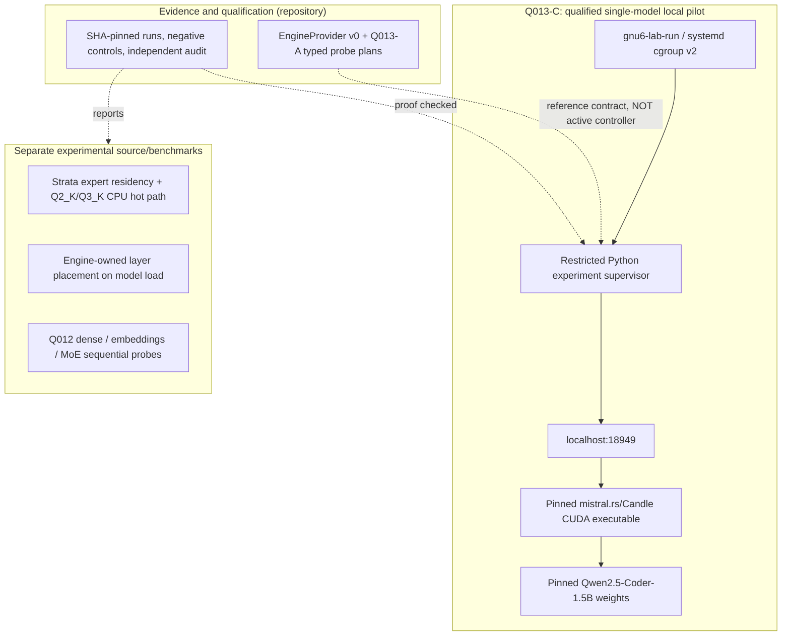
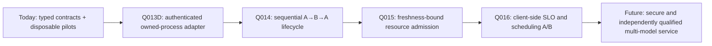

# Architecture · what exists, what is only a contract, who owns what

**2026-10-10 qualification snapshot.** gnostral.rs is a layered *research lab*, not a monolithic inference engine or a deployed orchestration service.

## Operational truth

**Key distinction:** Q013-A's Rust selection model is *not yet wired to the real Q013-C Python pilot*. Q013-B's Rust process fixture is a validated local subprocess boundary, not a generic executor or daemon. Q013-C is one hard-coded, identity-checked real server run and independent audit.

## Truth before availability

An engine may report that an endpoint is reachable while model weights are still loading, or respond to `/v1/models` before it can produce valid output. Therefore:

1. **Declared** — source or vendor says an operation exists.
2. **Planned** — a request has an exact SHA-bound capability/evidence match; still no execution grant.
3. **HTTP-ready** — control endpoint responds, not enough for inference.
4. **Semantic-ready** — an independently verified oracle succeeds on the exact engine and model.
5. **Serving** — only the admitted, bounded operation proceeds.
6. **Draining/unloading** — processes/requests are canceled or completed, engine unload acknowledged.
7. **Reclaimed** — host-sourced CPU/GPU observations show return to a stated ambient envelope.
8. **Qualified** — post-run independent auditor checks identities, negative gates and nonclaims.

These are **desired and/or tested states**, not evidence that every API stage is implemented in one always-running Rust supervisor.

## Authority table

| Concern | Owner | Reason |
| --- | --- | --- |
| Expert slot selection / quantization and compute kernels | Inference engine | Engine-specific, requires exact layout and scheduling semantics |
| KV paging, compression, per-head cooling/waking | Inference engine | No safe generic KV-materialization authority has passed Q008 |
| Model lifecycle intent, evidence requirements, resource *envelopes* | Future supervisor | Q007/Q008 contract permits intent + sourced facts |
| Actual host process/OS limits | systemd/cgroup kernel boundary | Test harness checks physical limits, never assumes flags alone are enforcement |
| GPU VRAM and CUDA fault telemetry | Device/runtime + host observations | Cgroups do not directly cap NVIDIA VRAM |
| Authentication, network/secret/tool permission | Separate privileged platform | Neither a model prompt nor EngineProvider trait receives automatic OS authority |
| Public claims and releases | Evidence/qualification gate | Independent proof and exact provenance required |

## The transport/security caveat

The Q013-C pilot talks to **localhost** on a fixed port, uses a private executable snapshot and a bounded prompt, and checks the pinned model weights before launch. This is useful for a controlled workstation experiment; it does **not** authenticate a hostile peer binding that port, guarantee weight immutability against a same-UID adversary, or supply public API security.

Q013-D exists to close the listener/PID and semantic trust gap with a real adapter. No delegated OS actions, arbitrary scripts, unknown models, background services or public routes are authorized by the current protocol.

## Model family taxonomy

- **Bonsai ternary/PTQ1:** separate low-bit research baseline and kernel experiments. Do not mix its throughput figures with Qwen3 MoE.
- **Qwen2.5-Coder-1.5B:** dense model; used by Q012 functional pass and the Q013-C real-process pilot.
- **Qwen3-Embedding-0.6B:** embedding-only response surface and 1024-dimension oracle; Q012 functional pass, **not** yet Q013-C real-process pilot.
- **Qwen3-30B-A3B Q2_K:** quantized MoE with CPU/GPU expert placement; Q010/Q011 performance and Q012 functional results; **not** hot-swappable.

## Architecture evolution

Potential upstream technology donors (Burn remote, Ferrum, CubeCL, WakeKV) remain on an **independent research lane**. Their commits are not proof of integration into this implementation.

See [capability matrix](CAPABILITY_MATRIX.md), [roadmap](ROADMAP.md) and [Q008 promotion decision](../quests/Q-008-MODELD-PROMOTION-GATE.md).
