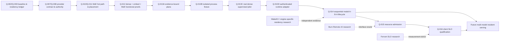

# gnostral.rs · research-to-runtime roadmap

**As of 2026-10-10. Technical sequencing, not a delivery schedule.**
[QUESTLOG](../QUESTLOG.md) · [Capability truth table](CAPABILITY_MATRIX.md) · [How to reproduce](REPRODUCIBILITY.md)

> **North star / cible :** an inspectable, Rust-first, **local** inference control plane for constrained hardware: engine-aware model selection, explicit resource envelopes, verifiable readiness, safe unloading and accountable performance. Kernels, KV and expert placement remain owned by each execution engine.

## The dependency graph

The dashed research links are **candidate inputs**, not dependencies, integrations or verified technology transfers.

## Lane A — harden actual local serving

### M0 · Proven baseline — CLOSED

Q010 CPU MoE A/B, Q011 load-time placement observation, Q012 three-family sequential functional qualification, Q013A typed evidence plans, Q013B CPU fixture process isolation and Q013C one genuine dense server with independent exact-oracle audit. See [matrix](CAPABILITY_MATRIX.md).

### M1 · Q-013D: prove identity **during** serving — NEXT, PROPOSED

**Goal:** turn the single dense experimental supervisor into a **narrow** validated Rust `EngineProvider` adapter, still refusing arbitrary programs/models.

Work packages:
1. Bind localhost listener to the **owned process** and session (PID reuse, port takeover, unexpected existing listener, early exit and stale health responses must be rejected).
2. Recheck binary+model identity at the relevant use boundary; define the trust model for file replacement/TOCTOU and prove that a snapshot cannot be swapped by an untrusted actor within scope.
3. Make semantic witness provenance verifiable, not just a caller-supplied `passed=true` or digest-shaped string.
4. Fresh host-sourced GPU/driver/cgroup observations during service; timeout, negative OOM/Xid path, cancellation and process-group reclaim.
5. Replay with a real dense model at strict memory headroom; exact result, explicit state transitions and independent post-run audit.

**Exit:** pinned identity + listener identity + semantic result + process-tree shutdown + bounded host/GPU reclaim + no desktop session loss, across a frozen repetition protocol with negative controls. One server only.

### M2 · Q-014: serialized A → B → A — PROPOSED

**Goal:** before claiming *hot swap*, prove **cold sequential lifecycle** with two different real model families.

Experiment:
- Process A dense → unload → confirm host RAM and GPU return.
- Process B embeddings (or safely supported MoE within RAM envelope) → unload → confirm return.
- Process A again → re-verify semantic output and no cumulative resource drift.
- Repeat with canceled startup, timeout mid-load, failure after semantic readiness and unavailable GPU reserve.

**Exit:** reproducible bounded load/serve/drain/unload/reclaim, correct outputs and negative gates at every transition. **This does not yet prove simultaneous serving, hot switching without interruption, or one-process model residency.**

### M3 · Q-015: resource admission — PROPOSED

Define a typed envelope for **max RAM, VRAM headroom, CPU threads, GPU/driver health and admission TTL**; enforce through systemd cgroups + sampled GPU data, rejecting stale/UNKNOWN records. Prove cold-start admission under synthetic VRAM reservation without evicting or starving the desktop. Engine retains precise layer/expert/KV mapping authority.

**Exit:** no over-claim of hard NVIDIA VRAM caps; explain TOCTOU limitations and actual failure path. No arbitrary modeld allocation controls.

### M4 · Q-016: quality-of-service instrumentation — PROPOSED

Record client-side TTFT/TPOT/visible ITL, P50/P95/P99, throughput, request failure and output correctness at fixed tokenizer/prompts/concurrency. Only then compare static prefill vs optional adapted scheduling, borrowing experimental ideas from Ferrum. Disable adaptation by default until causal gains survive paired-run tests.

**Exit:** confidence-bounded throughput/tail trade-offs on target hardware, not estimates displayed by `/health` alone.

### M5 · A real multi-model service — CONDITIONAL FUTURE

Possible only after M1–M4 and additional authority/security review: admission for >1 family, concurrency/isolation, secure API transport and identity, per-model health, failure/recovery, inspectable scheduling, packaging, distribution rights and a production operations plan.

## Lane B — cutting-edge research; **not** production adoption

| Priority | Program | First falsifiable experiment | Blocker |
| --- | --- | --- | --- |
| **P1** | [BURN-REMOTE-01](../research/runtime/RUST-INFERENCE-WATCH-20261010.md) · quantized tensor transport | Two local loopback peers; protocol v5 acceptance/v4 refusal; byte-for-byte schemes/scales/values in Q8/Q4/FP8/FP4; shape/layout changes and exact provenance | No local compatible Burn test matrix frozen yet |
| **P2** | [FERRUM-SLO-01](../research/runtime/RUST-INFERENCE-WATCH-20261010.md) · client tail metrics | Offline request trace and P99 TTFT/TPOT/ITL oracle, then same-model static vs opt-in SLO A/B | Upstream reported no established ShareGPT throughput benefit |
| **P2** | [WakeKV](../research/runtime/WAKEKV-LEAD-20261009.md) · reversible KV | Supported attention model, matched-VRAM static vs reversible CPU reservoir; correctness on wake/re-promotion and PCIe stalls | Paper read; local implementation/weights not verified |
| **P3** | [CubeCL](../research/runtime/RUST-INFERENCE-WATCH-20261010.md) · collective ordering | Concurrent transfers + collectives with explicit timeouts, independent GPU telemetry | Second physical GPU absent |
| **Ongoing** | Bonsai ternary PTQ1 / Q2K-Q3K MoE | Kernel layout, signs/LUT, actual prefill/decode, memory bandwidth and unsafe-code correctness tests | Distinct models/protocols must never be conflated |

Parallel research may be executed in independent worktrees; **no research intake is authorized to silently alter the Q012-pinned CUDA runtime**.

## Stop and release gates

- **Host:** use `gnu6-lab-run --exclusive` for inference, CUDA or heavy builds; read live RAM, GPU and graphical-session health before each attempt; do not disable systemd-oomd.
- **Safety:** fail closed on unknown identities, missing licenses, unverified semantic outputs, Xid events, driver instability, unreclaimed memory or unexpected processes.
- **Comparability:** preserve GPU card-usage vs per-process allocations, RSS vs PSS, host file cache vs engine warmness, original upstream vs patched engine vs lab-owned code.
- **Truth:** failed runs remain first-class evidence and never disappear when later retries pass.
- **Publication:** no release tag, public hosted API, production-performance assertion or broad portability claim until its own dedicated gate passes.

## The near-term order

1. **Now:** publish complete evidence navigation, maintain public QUESTLOG, and protect original local unpublished work.
2. **Next engineering slice:** Q013D listener/process identity + bounded negative tests (prefer CPU stubs first).
3. **Parallel low-resource research:** BURN-REMOTE-01 protocol/wire-format oracle; freeze a test plan before downloading/building.
4. **Then:** Q014 real sequential A→B→A pilot; only after Q013D permits reliable startup/stop under pressure.
5. **Later:** Q015 resource admission; Q016 trace-based SLO benchmarking; cross-vendor/multi-GPU by physical opportunity.

**Definition of progress:** one more independently auditable boundary established, not one more feature added to a roadmap.
